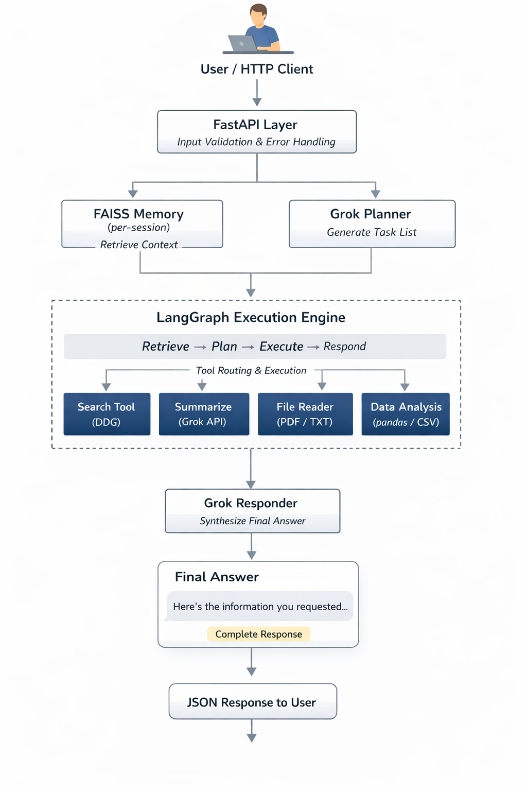
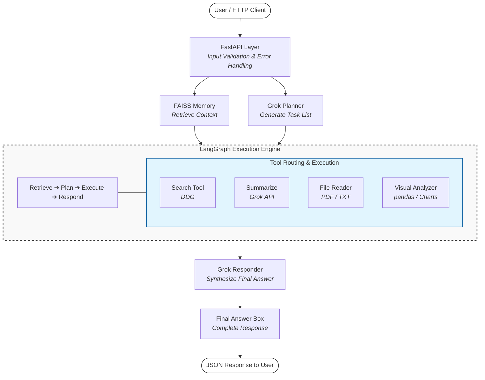

# ⚡ Agentic Workflow Automation

An advanced, production-grade AI system using **Grok LLM**, **LangGraph**, and **FAISS Semantic Memory** to automate complex, multi-step workflows.

---

## 🏛️ System Architecture



The architecture follows a high-performance, asynchronous pipeline built for scalability and data intelligence.



---

## 📂 Project Directory & File Mapping

| Category | File | Description |
| :--- | :--- | :--- |
| **Core** | `main.py` | Entry point. Initializes environment and boots the Uvicorn server. |
| **API** | `src/api.py` | REST endpoints (`/run-agent`, `/analyze-csv`). Handles singleton lifecycles. |
| **Engine** | `src/engine.py` | LangGraph `StateGraph` logic, nodes, edges, and topological execution. |
| **Memory** | `src/memory.py` | FAISS vector store. Manages per-session indexing and semantic search. |
| **Intelligence** | `src/grok_client.py` | Groq LLM wrapper with token-safe truncation and response synthesis. |
| **Planning** | `src/planner.py` | Converts natural language input into validated, structured task plans. |
| **Tools** | `src/tools/` | Specialized modules for Web Search, PDF/TXT Reading, and Data Analysis. |
| **UI** | `frontend/index.html` | Premium dashboard with Glassmorphism and real-time task tracing. |

---

## 🔥 Key Intelligence Features

### 1. **Token Truncation Safety**
The system implements a multi-layer **Payload Safety** mechanism to prevent `Groq 413` errors. This ensures that even massive search results or documents are condensed *before* being sent for final synthesis, staying within TPM/RPM limits.

### 2. **Proactive Memory Injection**
When files are uploaded, their metadata is instantly embedded into the FAISS memory. This allows the Agent to "remember" your files dynamically—you can simply say *"Summarize that file I just gave you"* and it will succeed without needing the filename.

### 3. **Path-Safe Execution**
The `file_reader` and `visual_analyzer` tools use proactive path resolution. If the agent provides a filename, the tools automatically check the secure `./data/` directory, preventing "File Not Found" errors common in standard agent implementations.

---

## 📊 Visual Intelligence (Visual Analyzer)
The system features a dedicated **Visual Analysis Engine** that goes beyond simple text parsing:
*   **Statistical Profiling**: Rows, columns, mean, std, and missing value detection.
*   **Correlation & Distributions**: Automatically builds configuration for Pie, Bar, Scatter, and Line charts.
*   **Geo-Intelligence**: Dynamically detects Latitude, Longitude, or Country names to build interactive Leaflet maps.

---

## 🚀 How to Run

1.  **Initialize Environment**:
    ```bash
    pip install -r requirements.txt
    ```
2.  **Set Credentials**: Update `.env` with your `GROK_API_KEY`.
3.  **Start Backend**:
    ```bash
    uvicorn main:app --reload
    ```
4.  **Launch Dashboard**: Open `frontend/index.html` in your browser.

---
*Powered by Grok & LangGraph*
